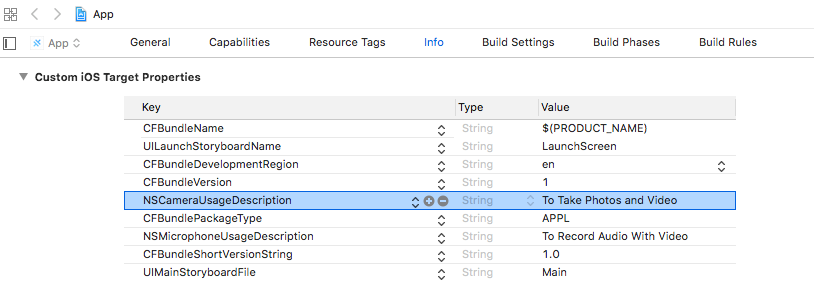

https://ionicframework.com/docs/react/your-first-app

### What We'll Build

- Photo Gallery App
- take photos with your device
- display them in a grid
- store them permanently on the device

### Highlights

- 1 React codebase that runs on the web, iOS and Android
- uses Ionic Framework UI components
- Deployed as native iOS and Android mobile apps using `Capacitor`
  - Ionic's Official Native App Runtime
- Photo Gallery functionality powered by the Capacitor Camera, Filesystem and Preferences API

- Complete App Codebase at https://github.com/ionic-team/photo-gallery-capacitor-react

### Required Tools

- Node.js
- VSCode
- CLI

### Install Ionic Tooling

```js
npm install -g @ionic/cli native-run cordova-res
```

- `native-run` = run native binaries on devices and emulators
- `cordova-res` = generate native app icons and splash screens

### Create an App (I called mine `ionic-photo`)

```js
ionic start photo-gallery tabs --type=react --capacitor
```

- starter comes with 3 built-in pages and ionic best practices
- change into the `photo-gallery` folder
- install the necessary Capacitor plugins to make the app's native functionality work

```js
cd photo-gallery

npm install @capacitor/camera @capacitor/preferences @capacitor/filesystem
```

### PWA Elements

- some of the Capacitor plugins (e.g. Camera API) provide the web-based functionality via the Ionic `PWA Elements Library`
- need to install that too

```js
npm install @ionic/pwa-elements
```

- open the app up in VSCode

```js
code . -r
```

- edit the `src/main.tsx` to import the '@ionic/pwa-elements'

```tsx
import React from 'react';
import { createRoot } from 'react-dom/client';
import App from './App';
import { defineCustomElements } from '@ionic/pwa-elements/loader';

const container = document.getElementById('root');
const root = createRoot(container!);
// Call the element loader before the render call
defineCustomElements(window);

root.render(
  <React.StrictMode>
    <App />
  </React.StrictMode>
);
```

- let's see the app in action ...

### Run the App

```js
ionic serve
```


### Photo Gallery

- 3 tabs
- tab 2 is blank - perfect for a Photo Gallery
- note: reload on change = Ionic CLI's Live Reload
- lets open `/src/pages/Tab2.tsx`

```tsx
import { IonContent, IonHeader, IonPage, IonTitle, IonToolbar } from '@ionic/react';
import ExploreContainer from '../components/ExploreContainer';
import './Tab2.css';

const Tab2: React.FC = () => {
  return (
    <IonPage>
      <IonHeader>
        <IonToolbar>
          <IonTitle>Tab 2</IonTitle>
        </IonToolbar>
      </IonHeader>
      <IonContent fullscreen>
        <IonHeader collapse="condense">
          <IonToolbar>
            <IonTitle size="large">Tab 2</IonTitle>
          </IonToolbar>
        </IonHeader>
        <ExploreContainer name="Tab 2 page" />
      </IonContent>
    </IonPage>
  );
};

export default Tab2;
```

- `IonHeader` = top navigation and toolbar
  - change `IonTitle` from "Tab 2" to "Photo Gallery"
- `IonContent` = visual aspects of our app
  - add a button that open's the device's camera AND
  - displays the image captured by the camera
  - add FAB(`floating action button`)
  - update the imports to include the Camera icon and some Ionic components that we'll use soon too

```tsx
import { camera, trash, close } from 'ionicons/icons';
import {
  IonContent,
  IonHeader,
  IonPage,
  IonTitle,
  IonToolbar,
  IonFab,
  IonFabButton,
  IonIcon,
  IonGrid,
  IonRow,
  IonCol,
  IonImg,
  IonActionSheet,
} from '@ionic/react';
```

- then add the FAB to the bottom of the page
  - use camera image as icon
  - call the `takePhoto()` function when the button is clicked

```tsx
<IonContent>
  <IonFab vertical="bottom" horizontal="center" slot="fixed">
    <IonFabButton onClick={() => takePhoto()}>
      <IonIcon icon={camera}></IonIcon>
    </IonFabButton>
  </IonFab>
</IonContent>
```

- should look like this ...

```tsx
import { camera, trash, close } from 'ionicons/icons';
import {
  IonContent,
  IonHeader,
  IonPage,
  IonTitle,
  IonToolbar,
  IonFab,
  IonFabButton,
  IonIcon,
  IonImg,
  IonGrid,
  IonRow,
  IonCol,
  IonActionSheet,
} from '@ionic/react';
import ExploreContainer from '../components/ExploreContainer';
import './Tab2.css';

const Tab2: React.FC = () => {
  return (
    <IonPage>
      <IonHeader>
        <IonToolbar>
          <IonTitle>Photo Gallery</IonTitle>
        </IonToolbar>
      </IonHeader>
      <IonContent>
        <IonHeader collapse='condense'>
          <IonToolbar>
            <IonTitle size='large'>Photo Gallery</IonTitle>
          </IonToolbar>
        </IonHeader>
        <IonFab vertical='bottom' horizontal='center' slot='fixed'>
          <IonFabButton onClick={() => takePhoto()}>
            <IonIcon icon={camera}></IonIcon>
          </IonFabButton>
        </IonFab>
      </IonContent>
    </IonPage>
  );
};

export default Tab2;

```


- NEXT: open `src/App.tsx`
  - remove the `ellipse` icon and import the `images` icon instead

```tsx
import { images, square, triangle } from 'ionicons/icons';
```

- Within the tab bar (\<IonTabBar>), change the label to “Photos” and the `ellipse` icon to `images` for the middle tab button:

```tsx
<IonTabButton tab="tab2" href="/tab2">
  <IonIcon icon={images} />
  <IonLabel>Photos</IonLabel>
</IonTabButton>
```


> [!Note]
>
> In Ionic React, icons are imported individually from `ionicons/icons` and set to the `icon` prop.

NEXT: implement camera-taking functionality

### Taking Photos with the Camera

- use the Capacitor `Camera API`
- begin with building it for the web and tweak it then for iOS and Android
- create our own custom React Hook that will manage the photos for the gallery
- see [Introducing React Hooks](https://reactjs.org/docs/hooks-intro.html)

- create a new file - `src/hooks/usePhotoGallery.ts`
- custom hook = a function that uses other React hooks!!!
- start by importing the hooks and utilities we will use from the React core, the Ionic React hooks project and Capacitor

```ts
import { useState, useEffect } from 'react';
import { isPlatform } from '@ionic/react';

import { Camera, CameraResultType, CameraSource, Photo } from '@capacitor/camera';
import { Filesystem, Directory } from '@capacitor/filesystem';
import { Preferences } from '@capacitor/preferences';
import { Capacitor } from '@capacitor/core';
```

- create a function called `usePhotoGallery`

```ts
export function usePhotoGallery() {
  const takePhoto = async () => {
    const photo = await Camera.getPhoto({
      resultType: CameraResultType.Uri,
      source: CameraSource.Camera,
      quality: 100,
    });
  };

  return {
    takePhoto,
  };
}
```

- Our usePhotoGallery hook exposes a method called `takePhoto,` which in turn calls into Capacitor's `getPhoto` method.

- Notice the magic here: there's NO platform-specific code (web, iOS, or Android)!
- The Capacitor Camera plugin abstracts that away for us, leaving just one method call - getPhoto() - that will open up the device's camera and allow us to take photos.

- The last step we need to take is to use the new hook from the Tab2 page. Go back to Tab2.tsx and import the hook:

```tsx
import { usePhotoGallery } from '../hooks/usePhotoGallery';
```

- And right before the return statement in the functional component, get access to the `takePhoto` method by using the hook:

```tsx
const Tab2: React.FC = () => {
  const { takePhoto } = usePhotoGallery();

  // snip - rest of code
```

- save the file and restart the dev server by running `ionic serve`
- on the Photo Gallery tab, click the Camera button
- if your device has a webcam, a modal window should appear
- take a selfie

- After taking a photo, it disappears!! We still need to display it within our app and save it for future access!!!

### Displaying Photos

- create a new type to define our Photo
- holds specific metadata
- add the following UserPhoto Interface to the usePhotoGallery.ts file somewhere outside of the main function

```ts
export interface UserPhoto {
  filepath: string;
  webviewPath?: string;
}
```

- define a state variable to store the array of each photo taken

```ts
const [photos, setPhotos] = useState<UserPhoto[]>([]);
```

- after the camera takes a picture, the resultant `Photo` returned from Capacitor will be stored in the `photo` variable
- we want to create a new `photo` object and add it to the photos state array
- don't mutate the current photos array accidentally - make a new array, then call `setPhotos` to store the array into state
- update the `takePhoto` method and the following after the `getPhoto` call

```ts
const fileName = Date.now() + '.jpeg';
const savedFileImage = await savePicture(photo, fileName);
const newPhotos = [
  {
    filepath: fileName,
    webviewPath: photo.webPath,
  },
  ...photos,
];
setPhotos(newPhotos);
```

- expose the photos array from our hook by updating the return statement to include the photos

```ts
return {
  photos,
  takePhoto,
};
```

- back in Tab2 component -> get access to the photos

```tsx
const { photos, takePhoto } = usePhotoGallery();
```

- with the photo(s) stored into the main array we can display the images on the screen.
- Add a Grid component so that each photo will display nicely as photos are added to the gallery, and loop through each photo in the Photos array, adding an Image component (\<IonImg>) for each.
- Point the src (source) to the photo’s path:

```tsx
<IonContent>
  <IonGrid>
    <IonRow>
      {photos.map((photo, index) => (
        <IonCol size="6" key={photo.filepath}>
          <IonImg src={photo.webviewPath} />
        </IonCol>
      ))}
    </IonRow>
  </IonGrid>
   <!-- <IonFab> markup  -->
</IonContent>
```

- Within the web browser, click the Camera button and take another photo. This time, the photo is displayed in the Photo Gallery!

NEXT: we’ll add support for saving the photos to the filesystem, so they can be retrieved and displayed in our app at a later time.

### Saving Photos to the Filesystem

- we're going to get access to the `writeFile` method from the `Filesystem` class
- we'll do this via the `usePhotoGalllery` hook
- lets create a few new functions

```ts

// add savePicture to the usePhotoGallery fn
export function usePhotoGallery() {
  const savePicture = async (photo: Photo, fileName: string): Promise<UserPhoto> => {
    const base64Data = await base64FromPath(photo.webPath!);
    const savedFile = await Filesystem.writeFile({
      path: fileName,
      data: base64Data,
      directory: Directory.Data,
    });

    // Use webPath to display the new image instead of base64 since it's
    // already loaded into memory
    return {
      filepath: fileName,
      webviewPath: photo.webPath,
    };
  };
}

// new function - add to bottom of file
export async function base64FromPath(path: string): Promise<string> {
  const response = await fetch(path);
  const blob = await response.blob();
  return new Promise((resolve, reject) => {
    const reader = new FileReader();
    reader.onerror = reject;
    reader.onload = () => {
      if (typeof reader.result === 'string') {
        resolve(reader.result);
      } else {
        reject('method did not return a string');
      }
    };
    reader.readAsDataURL(blob);
  });
}
```

- the `base64FromPath` method is a helper util that downloads a file from the supplied path and returns a base64 representation of that file

- pass in `photo` object = newly captured device photo + fileName (provides a path for the file to be stored to)
- use Capacitor `Filesystem API` to save the photo to the filesystem

  - convert photo to base64 format
  - feed the data to the Filesystem's `writeFile` fn
  - call `savePicture`- pass in the photo object and filename under the call to `setPhotos` in the `takePhoto` method

- At this point, each time a new photo is taken it's automatically saved to the filesystem ...

NEXT: the photos are stored in the filesystem BUT we need a way to save pointers to each file so that they can be displayed again in the photo gallery!!!

### Loading Photos from the Filesystem

- we'll leverage Capacitor's `Preferences API` to store our array of Photos in a key-value store

#### Preferences API

- need to define a const var that will act as the key for the store BEFORE the `usePhotoGallery` function

```ts
const PHOTO_STORAGE = 'photos';
```

- then, use the `Storage` class to get access to the `get` and `set` methods for reading and writing to device storage
- end of `takePhoto` fn, add a call to `Preferences.set()` to save the photos array
  - adding here, Photos array is stored EACH time a photo is taken

```ts
...setPhotos(newPhotos);
    Preferences.set({ key: PHOTO_STORAGE, value: JSON.stringify(newPhotos)});
  };
...
```

- with the Photos array saved, we'll create a method that will retrieve the data when the hook loads - we'll use React's `useEffect` hook above the `takePhoto` declaration

```ts
useEffect(() => {
  const loadSaved = async () => {
    const { value } = await Preferences.get({ key: PHOTO_STORAGE });
    const photosInPreferences = (value ? JSON.parse(value) : []) as UserPhoto[];

    for (let photo of photosInPreferences) {
      const file = await Filesystem.readFile({
        path: photo.filepath,
        directory: Directory.Data,
      });
      // Web platform only: Load the photo as base64 data
      photo.webviewPath = `data:image/jpeg;base64,${file.data}`;
    }
    setPhotos(photosInPreferences);
  };
  loadSaved();
}, []);
```

- second parameter = \[ ] = the dependency array
- useEffect will be called each time the component is rendered
  - UNLESS we pass in a dependency array
    - will run then when the dependency gets updated
  - in our case, we just want it to run ONCE
  - we pass in an empty array so we can prevent the hook from being called multiple times!!!
- NOTE: the first parameter = anonymous arrow fn
  - inside of it we define another async method and immediately call this
  - we have to call the async fn from within the hook AS the hook callback can NOT be async itself!!!
- On mobile, as we'll see later, we can directly set the source of an image tag
  - ``
  - to each photo file on the Filesystem, displaying them automatically
- On the web HOWEVER, we must read the images in the base64 format because the Filesystem API stores them in base64 within `IndexedDB` under the hood

- At this point, we should have an app that works on the web!!!
- TEST: take some photos, they should appear in the gallery and persist when the page is refreshed!!

- NEXT: transform the app into a mobile app for iOS and Android

## Adding Mobile

- we'd like our app to run on web, iOS and Android using the one codebase
- to get it to run on mobile too
  - small logic changes
  - install some native tooling
  - run the app on a device
- our app should "just work" when we deploy it to a device!!

### Platform-specific Logic

- update the photo saving functionality to support mobile
  - `savePicture` fn -> check which platform the app is running on
  - if it's hybrid (Capacitor or Cordova = the two native runtimes), then read the photo file into base64 using the `readFile` method
  - return the complete file path to the photo using the Filesystem API
  - when setting `webviewPath`, use the special `Capacitor.convertFileSrc` method - otherwise use the same logic as before for the web

// Rewrite `savePicture` fn

```ts
const savePicture = async (photo: Photo, fileName: string): Promise<UserPhoto> => {
  let base64Data: string | Blob;
  // "hybrid" will detect Cordova or Capacitor;
  if (isPlatform('hybrid')) {
    const file = await Filesystem.readFile({
      path: photo.path!,
    });
    base64Data = file.data;
  } else {
    base64Data = await base64FromPath(photo.webPath!);
  }
  const savedFile = await Filesystem.writeFile({
    path: fileName,
    data: base64Data,
    directory: Directory.Data,
  });

  if (isPlatform('hybrid')) {
    // Display the new image by rewriting the 'file://' path to HTTP
    // Details: https://ionicframework.com/docs/building/webview#file-protocol
    return {
      filepath: savedFile.uri,
      webviewPath: Capacitor.convertFileSrc(savedFile.uri),
    };
  } else {
    // Use webPath to display the new image instead of base64 since it's
    // already loaded into memory
    return {
      filepath: fileName,
      webviewPath: photo.webPath,
    };
  }
};
```

- next, add a some logic in the `loadSaved` fn
- on mobile, we can directly point to each photo file on the Filesystem and display them automatically
  - on web, we must read each image from the Filesystem into base64 format
  - because the `Filesystem API` uses `IndexedDB` under the hood
- update the `loadSaved` fn inside of `useEffect` ..

```ts
const loadSaved = async () => {
  const { value } = await Preferences.get({ key: PHOTO_STORAGE });

  const photosInPreferences = (value ? JSON.parse(value) : []) as UserPhoto[];
  // If running on the web...
  if (!isPlatform('hybrid')) {
    for (let photo of photosInPreferences) {
      const file = await Filesystem.readFile({
        path: photo.filepath,
        directory: Directory.Data,
      });
      // Web platform only: Load the photo as base64 data
      photo.webviewPath = `data:image/jpeg;base64,${file.data}`;
    }
  }
  setPhotos(photosInPreferences);
};
loadSaved();
  }, []);
```

- at this point, our app consists of one codebase that runs on the web, iOS and Android

- NEXT: deploy the app to a device

### Deploying to iOS and Android

#### Capacitor Setup

- Capacitor = Ionic's official app runtime
- makes it easy to deploy web apps to native platforms like iOS and Android
- cancel `ionic serve`
- complete a fresh re-build of the Ionic Project fixing any errors ..

```
ionic build
```

```
vite v5.2.9 building for production...
✓ 263 modules transformed.
dist/assets/status-tap-legacy-LLRzUJn2.js                         0.60 kB │ gzip:   0.40 kB
dist/assets/focus-visible-legacy-CdO5cX4I.js                      1.09 kB │ gzip:   0.55 kB
dist/assets/md.transition-legacy-DBQAxzsS.js                      1.13 kB │ gzip:   0.62 kB
dist/assets/web-legacy-BuSQSSpK.js                                1.33 kB │ gzip:   0.62 kB
dist/assets/keyboard2-legacy-m4Gjvy5u.js                          1.40 kB │ gzip:   0.71 kB
dist/assets/pwa-toast.entry-legacy-DjfmD2Oe.js                    1.63 kB │ gzip:   0.78 kB
dist/assets/index9-legacy-jMFbI1gm.js                             1.74 kB │ gzip:   0.87 kB
dist/assets/pwa-camera-modal.entry-legacy-B7QLyyLJ.js             3.01 kB │ gzip:   1.32 kB
dist/assets/pwa-action-sheet.entry-legacy-CwhVKYZ7.js             3.01 kB │ gzip:   1.11 kB
dist/assets/pwa-camera-modal-instance.entry-legacy-E6vBWnfS.js    3.45 kB │ gzip:   1.48 kB
dist/assets/input-shims-legacy-CwF6XJNd.js                        4.74 kB │ gzip:   2.08 kB
dist/assets/swipe-back-legacy-Cu4O7O8f.js                         6.61 kB │ gzip:   2.67 kB
dist/assets/web-legacy-QzuXltEd.js                                8.70 kB │ gzip:   2.89 kB
dist/assets/ios.transition-legacy-BQExJKOO.js                    10.42 kB │ gzip:   2.97 kB
dist/assets/pwa-camera.entry-legacy-B0gQWQl2.js                  22.77 kB │ gzip:   6.66 kB
dist/assets/polyfills-legacy-GxdZSwDe.js                         61.84 kB │ gzip:  24.93 kB
dist/assets/index-legacy-CQQn0zgZ.js                            423.82 kB │ gzip: 118.23 kB
dist/index.html                                            2.33 kB │ gzip:   1.02 kB
dist/assets/index-Z0ow5Chf.css                            29.40 kB │ gzip:   5.47 kB
dist/assets/status-tap-D07F5CfY.js                         0.48 kB │ gzip:   0.34 kB
dist/assets/focus-visible-supuXXMI.js                      0.99 kB │ gzip:   0.51 kB
dist/assets/md.transition-UERfiw29.js                      1.07 kB │ gzip:   0.57 kB
dist/assets/web-304Hl1mb.js                                1.25 kB │ gzip:   0.59 kB
dist/assets/keyboard2-CFnPGz5r.js                          1.28 kB │ gzip:   0.66 kB
dist/assets/pwa-toast.entry-DyEcQQWj.js                    1.55 kB │ gzip:   0.73 kB
dist/assets/index9-B6oeM2vd.js                             1.63 kB │ gzip:   0.84 kB
dist/assets/pwa-camera-modal.entry-BiJw_hDh.js             2.91 kB │ gzip:   1.29 kB
dist/assets/pwa-action-sheet.entry-Cr04IBFz.js             2.93 kB │ gzip:   1.07 kB
dist/assets/pwa-camera-modal-instance.entry-_DowYbMg.js    3.36 kB │ gzip:   1.46 kB
dist/assets/input-shims-ASDbFZZo.js                        4.83 kB │ gzip:   2.08 kB
dist/assets/swipe-back-DQ2ZZddc.js                         6.68 kB │ gzip:   2.71 kB
dist/assets/web-D7lWV04T.js                                8.68 kB │ gzip:   2.94 kB
dist/assets/ios.transition-Bc0iN3mu.js                    10.94 kB │ gzip:   3.05 kB
dist/assets/pwa-camera.entry-Bl75d4oB.js                  23.29 kB │ gzip:   7.10 kB
dist/assets/index-Dn6kk3JV.js                            408.53 kB │ gzip: 118.44 kB
✓ built in 5.63s
```

- no errors - nice!!

- NEXT: create both the iOS and Android projects

```
ionic cap add ios
ionic cap add android
```

```
> capacitor add ios
[capacitor] ✔ Adding native Xcode project in ios in 13.13ms
[capacitor] ✔ add in 13.38ms
[capacitor] ✔ Copying web assets from dist to ios/App/App/public in 13.66ms
[capacitor] ✔ Creating capacitor.config.json in ios/App/App in 292.04μs
[capacitor] ✔ copy ios in 40.79ms
[capacitor] ✔ Updating iOS plugins in 2.28ms
[capacitor] [warn] Skipping pod install because CocoaPods is not installed
[capacitor] ✔ Updating iOS native dependencies with pod install in 3.57s
[capacitor] [info] Found 7 Capacitor plugins for ios:
[capacitor]        @capacitor/app@6.0.0
[capacitor]        @capacitor/camera@6.0.0
[capacitor]        @capacitor/filesystem@6.0.0
[capacitor]        @capacitor/haptics@6.0.0
[capacitor]        @capacitor/keyboard@6.0.0
[capacitor]        @capacitor/preferences@6.0.0
[capacitor]        @capacitor/status-bar@6.0.0
[capacitor] ✔ update ios in 3.58s
[capacitor] [success] ios platform added!
[capacitor] Follow the Developer Workflow guide to get building:
[capacitor] https://capacitorjs.com/docs/basics/workflow
```

```
> capacitor add android
[capacitor] ✔ Adding native android project in android in 20.45ms
[capacitor] ✔ add in 20.94ms
[capacitor] ✔ Copying web assets from dist to android/app/src/main/assets/public in 12.16ms
[capacitor] ✔ Creating capacitor.config.json in android/app/src/main/assets in 282.33μs
[capacitor] ✔ copy android in 23.53ms
[capacitor] ✔ Updating Android plugins in 2.99ms
[capacitor] [info] Found 7 Capacitor plugins for android:
[capacitor]        @capacitor/app@6.0.0
[capacitor]        @capacitor/camera@6.0.0
[capacitor]        @capacitor/filesystem@6.0.0
[capacitor]        @capacitor/haptics@6.0.0
[capacitor]        @capacitor/keyboard@6.0.0
[capacitor]        @capacitor/preferences@6.0.0
[capacitor]        @capacitor/status-bar@6.0.0
[capacitor] ✔ update android in 28.45ms
[capacitor] ✔ Syncing Gradle in 80.96μs
[capacitor] [success] android platform added!
[capacitor] Follow the Developer Workflow guide to get building:
[capacitor] https://capacitorjs.com/docs/basics/workflow
➜  ionic-photo git:(main) ✗
```

- we get both `ios` and `android` folders created at the root of the project
- NOTE: every time that you perform a build of the project, you need to copy those changes into your native projects!!!!!

```
ionic cap copy
```

- in a similar way, every time that you make updates to the native part of the code (e.g. adding a new plugin), you need to "sync" the changes ...

```
ionic cap sync
```

### iOS

> [!Note]
> To build an iOS app, you'll need a Mac computer>

- Capacitor apps are configured and managed through XCode (Apple's iOS/Mac IDE)
- dependencies are managed by CocoaPods
- run the Capacitor `open` command - opens the native iOS project in XCode

```
ionic cap open ios
```

- some native plugins require user permissions to work
- for our Photo Gallery app, this includes the Camera plugin
- iOS displays a modal dialog the first time that `Camera.getPhoto()` is called
  - prompts the user to allow the app to use the camera
  - permission = "Privacy - Camera Usage"
  - to set it, the `Info.plist` must be modified
  - click "Info" and expand `Custom iOS Target Properties`



- each setting in `Info.plist` has a low-level parameter name AND a high-level name
- the property list editor shows the high-level names
- to see the low-level names, right-click and toggle "Raw Keys / Values"
- add the `NSCameraUsageDescription` Key and set the Value to something that describes why the app needs to use the camera
  - "To Take Photos"
  - this field is displayed to the user when the permission prompt opens
- follow the same process to add the two other Keys required for the Camera plugin;
  - `NSPhotoLibraryAddUsageDescription`
  - `NSPhotoLibraryUsageDescription`
- Next, click on `App` in the Project Navigator on the left hand side, the within the `Signing and Capabilities`section, select your development team

- with the permissions in place, we are ready to try out the app on a real device!!!
- connect an iOS device to your Mac, select it (App -> Alun's iPhone for me), then click "Build" to build, install and launch the app on your device!!


- on tapping the Camera button, the permission prompt will display
- tap OK and then take a picture, which should show in the app!!


- Note: to run on my iPhone I had to go to Settings > General > VPN and Device Management -> set the phone to trust me as a Trusted Developer

### Android

- capacitor apps are configured and run through Android Studio
- run the `ionic cap open android`
  - opens the native Android project in Android Studio
- similar to iOS, we have to enable the correct permissions to use the camera
- you can configure these in the `AndroidManifest.xml`
- go to `android/app/src/main` if Android does NOT automatically open the file
- Note: you will have to have Android Studio installed - please install it first if you do NOT already have it
- scroll to permissions section of the file and add the following two lines if they're not already there ..

```
<uses-permission android:name="android.permission.READ_EXTERNAL_STORAGE"/>
<uses-permission android:name="android.permission.WRITE_EXTERNAL_STORAGE" />
```

- connect an Android device and click the "Run" button, select the Android device you're using and then OK to build, install and launch the app on your device
- TEST - allow the camera permissions, take a photo and it should appear on the screen once you've accepted it!!


- our Photo Gallery app now works on both mobile devices
- HOWEVER - we need a delete function to stop it clogging up our storage with photos!!!
- we'll use the Ionic's CLI's Live Reload to quickly implement photo deletion to finish the app off!!!!

### Rapid App Development with Live Reload

- when active, `Live Reload` will reload the browser and / or WebView when changes in the app are detected

#### Live Reload

- `ionic serve` = live reload working in the browser
- we can also use it when developing on iOS and Android devices - useful for writing code that interacts with native plugins!!
- lets use Live Reload to implement photo deletion
- choose a device - I'll use iOS - and connect to your computer
- use the respective command in the terminal

```
ionic cap run ios --external
ionic cap run android --external
```

- the live reloader will start up and the native IDE of choice should open if not already
- from the IDE, click the play button to launch the app on your device

### Deleting Photos

- open Tab2.tsx and import `useState` and `UserPhoto`

```
import React, { useState } from 'react';
import { usePhotoGallery, UserPhoto } from '../hooks/usePhotoGallery';
// other imports
```

- reference the `deletePhoto` function which we'll create soon

```tsx
const { photos, takePhoto, deletePhoto } = usePhotoGallery();
```

- add a state value to store information about the photo to delete

```tsx
const [photoToDelete, setPhotoToDelete] = useState<UserPhoto>();
```

- when a user clicks on an image we'll show the action sheet by changing the state value to the photo
  - update the \<IonImg> to ...

```tsx
<IonImg onClick={() => setPhotoToDelete(photo)} src={photo.webviewPath} />
```

- Next, add an `IonActionSheet` dialog with the option to either DELETE the selected photo or CANCEL (close) the dialog
- set the `isOpen` property based on if the `photoToDelete` has a value or not
- put the following before the \</IonContent> tag ...

```tsx
<IonActionSheet
  isOpen={!!photoToDelete}
  buttons={[
    {
      text: 'Delete',
      role: 'destructive',
      icon: trash,
      handler: () => {
        if (photoToDelete) {
          deletePhoto(photoToDelete);
          setPhotoToDelete(undefined);
        }
      },
    },
    {
      text: 'Cancel',
      icon: close,
      role: 'cancel',
    },
  ]}
  onDidDismiss={() => setPhotoToDelete(undefined)}
/>
```

- Note: it's important to set the `onDidDismiss` fn and set our `photoToDelete` back to undefined when the modal goes away
  - if another image is clicked the action sheet notices the change in the value of `photoToDelete`
- Next - we need to add the `deletePhoto` method that will come from the `usePhotoGallery` hook

```ts
const deletePhoto = async (photo: UserPhoto) => {
  // Remove this photo from the Photos reference data array
  const newPhotos = photos.filter((p) => p.filepath !== photo.filepath);

  // Update photos array cache by overwriting the existing photo array
  Preferences.set({ key: PHOTO_STORAGE, value: JSON.stringify(newPhotos) });

  // delete photo file from filesystem
  const filename = photo.filepath.substr(photo.filepath.lastIndexOf('/') + 1);
  await Filesystem.deleteFile({
    path: filename,
    directory: Directory.Data,
  });
  setPhotos(newPhotos);
};
```

- selected photo is removed from the Photos array first
- Capacitor Preferences API - update the cached version of the Photos Array
- finally we delete the photo itself using the Filesystem API
- make sure to return the `deletePhoto` fn so it is a part of the hook that we expose

```ts
return {
  photos,
  takePhoto,
  deletePhoto,
};
```

- now we should be able to take a photo, touch the photo in the gallery to get a delete / cancel option. The cancel option returns us to the gallery and we can select a different photo to delete. The delete option does what it say!!!!

- the next stage would be build and deploy the app to user devices via the app stores

  - you can use an AppFlow product from Ionic that simplifies this procedure

- You could try adding another Ionic UI component to the app or more native functionality - the sky's the limit on app building!!!!!
